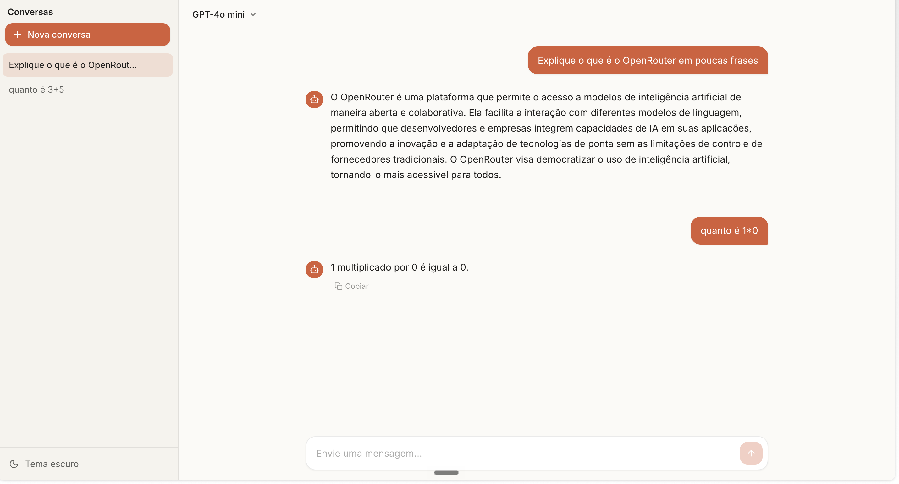

# chat-open-router



Interface de chat conversacional (estilo Claude) em React + TypeScript +
Tailwind CSS, com um backend Express que fala com a API do
[OpenRouter](https://openrouter.ai). A chave de API fica só no servidor —
nunca é enviada ao navegador.

Funcionalidades:

- Sidebar com histórico de conversas (criar, renomear, excluir) — persistido no `localStorage`.
- Seletor de modelo por conversa (lista curada de modelos populares do OpenRouter).
- Bolhas de mensagem com renderização de **Markdown** + blocos de código com syntax highlight.
- Botão de **Parar geração**.
- Tema claro/escuro.
- Layout responsivo (sidebar recolhível no mobile).

## Arquitetura

```
navegador (React)  →  /api/chat  →  servidor Express (server/index.js)  →  OpenRouter
```

- **`server/index.js`** — servidor Express. Lê `OPENROUTER_API_KEY` do `.env`
  e expõe `POST /api/chat`, que repassa `{ model, messages }` pro OpenRouter.
- **`src/services/openrouter.ts`** — no frontend, só chama `fetch("/api/chat", ...)`.
  Não tem nenhuma chave de API no código do navegador.
- **`vite.config.ts`** — redireciona (`proxy`) as chamadas a `/api` do Vite
  (porta 5173) pro servidor Express (porta 3001), pra não precisar de CORS.

## Configuração

1. Copie `.env.example` para `.env`:
   ```bash
   cp .env.example .env
   ```
2. Gere uma chave em [openrouter.ai/settings/keys](https://openrouter.ai/settings/keys)
   e cole no `.env`:
   ```
   OPENROUTER_API_KEY=sk-or-v1-sua-chave-aqui
   ```
   O `.env` está no `.gitignore` — não vai pro Git.

## Rodando o projeto

```bash
npm install
npm run dev
```

Isso sobe o frontend (`http://localhost:5173`) e o backend (`http://localhost:3001`)
ao mesmo tempo. Se quiser rodar cada um separado:

```bash
npm run dev:client   # só o frontend (Vite)
npm run dev:server   # só o backend (Express)
```

## Stack

- [Vite](https://vitejs.dev/) + React + TypeScript
- [Tailwind CSS](https://tailwindcss.com/)
- [react-markdown](https://github.com/remarkjs/react-markdown) + [react-syntax-highlighter](https://github.com/react-syntax-highlighter/react-syntax-highlighter)
- [Express](https://expressjs.com/) + [dotenv](https://github.com/motdotla/dotenv) no backend
